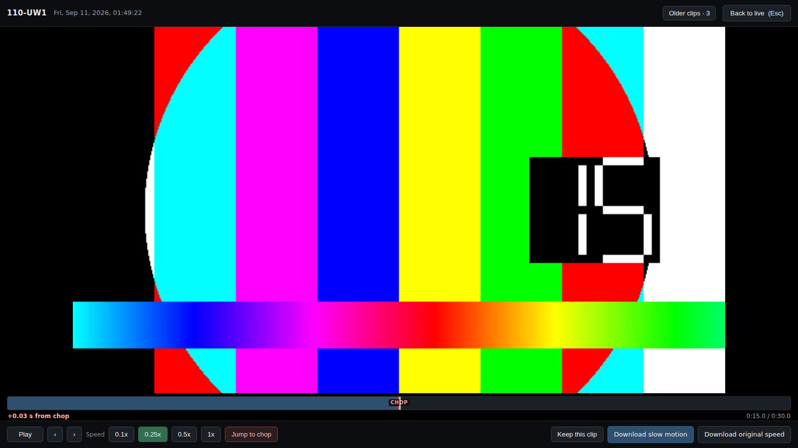
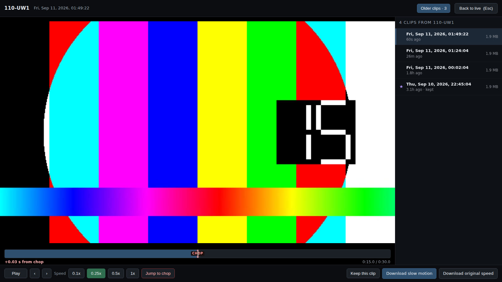
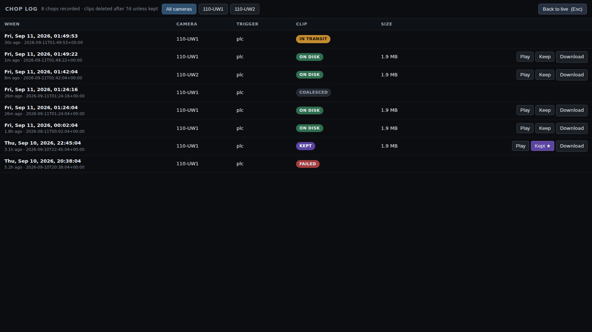

# Wall layouts

The aggregator arranges tiles from the number of cameras at that install, so
they fill the monitor rather than leaving a ragged row:

    columns = ceil(sqrt(n))      rows = ceil(n / columns)

| Cameras | Layout | | Cameras | Layout |
|---|---|---|---|---|
| 1 | 1 | | 6 | 3 × 2 |
| 2 | 2 | | 7 | 3 + 3 + 1 |
| 3 | 2 + 1 | | 8 | 3 + 3 + 2 |
| 4 | 2 × 2 | | 9 | 3 × 3 |
| 5 | 3 + 2 | | 16 | 4 × 4 |

A last row with fewer tiles than columns is **centred**, not left-aligned —
otherwise there is a hole in the corner that reads as a missing camera. Tiles
span two of a doubled column track, which makes that offset exact: centring two
tiles across three columns is half a tile, which whole tracks cannot express.

Narrow windows fall back to however many columns actually fit, so the wall stays
readable from a laptop instead of producing slivers, and it recomputes on
resize.

Adding or removing a camera is one entry in `NODES` and a restart. Nothing else
changes.

> The shots below use simulated nodes and test patterns in place of real
> cameras. The wall shots are 1920×1080; the player shots 1600×900. Every
> control and label is the real page — only the footage is synthetic.

---

## 1 camera

A single tile takes the whole screen. Healthy, with its most recent chop ready
to play.

## 2 cameras

Side by side, full height. A 16:9 feed letterboxes top and bottom here, because
the tile shape comes from dividing the screen, not from the feed.

## 3 cameras

Two over one, the bottom tile centred. This one shows three different states at
once: a delivered chop, one still transcoding on its node, and a node that is
not answering at all — covered, because an unreachable node otherwise keeps
showing its last frozen frame and reads as working.

## 4 cameras

An even 2 × 2.

## 5 cameras

Three over two, the bottom row centred. Every state the wall can show:

| Tile | Badge | Button | Meaning |
|---|---|---|---|
| UW1 | HEALTHY | `Last chop · 1m` | working normally |
| UW2 | HEALTHY | `Chop processing · 4m` | fired, still transcoding on the node |
| UW3 | HEALTHY | `Chop delayed · 48m` | **fired long ago and never arrived** |
| UW4 | DEGRADED | `Last chop · 1m` | node faulted, past clips still play |
| UW5 | UNREACHABLE | `No clips yet` | node offline |

UW3 is the one worth understanding. The node reports itself healthy — camera
streaming, PLC connected — yet its footage is not arriving. That is a wedged
transcode, a full disk or broken key auth, and nothing else in the system would
notice it. The header counts it too: `1 delayed`.

UW4 is the opposite: the node is sick, but clips it delivered earlier still
play fine.

## 16 cameras

A clean 4 × 4, needing no centring. All sixteen MJPEG streams run at once —
browsers cap connections at six *per host*, and each node is its own host, so
that limit never applies.

At this scale the constraint is decode, not connections: sixteen MJPEG streams
is a lot of JPEG for a Pi 5 to unpack. That is what `LIVE_FPS` on each node is
for — 5–8 fps per node keeps the wall comfortable. It is not something five
cameras will run into.

## Watching a chop

Every tile carries one button, showing that camera's most recent clip and its
age. Click it and the clip fills the screen, playing at **0.25x**. That camera's
older clips are one more click away once you are in there — the tile bar has to
stay readable from across a room, so it holds the button people actually press.

Top left is the node and when the chop was recorded, as local date and time.
Along the bottom:

| Control | Does |
|---|---|
| **Pause** / **Play** | toggles; the spacebar does the same |
| **&lsaquo;** / **&rsaquo;** | step back or forward a frame or two; `,` and `.` do the same |
| **0.1x / 0.25x / 0.5x / 1x** | playback speed; 0.25x is where it opens |
| **Jump to chop** | seeks to just before the trigger instant; `c` does the same |
| **Keep this clip** | moves it where the purge cannot delete it; `k` does the same |
| **Download slow motion** | a 4x slow copy that plays slowly in *any* player |
| **Download original speed** | the true-speed file |
| **Back to live** (or Esc) | returns to the wall |

Arrow keys seek a second at a time.

### The trigger instant is marked

The bar under the video is the player's own, not the browser's. The browser's
scrub bar cannot be drawn on, and there is exactly one thing worth drawing on
it: **where the chop actually happened**. It is the red `CHOP` mark.

The readout under the bar is in seconds **from the chop**, not from the start of
the file — `−2.40 s` means two and a bit seconds before contact. Clicking
anywhere on the bar seeks there.

The mark is placed at `duration − POST_SECONDS`, measured back from the end
rather than forward from the start, and the node publishes its own
`POST_SECONDS` at `/healthz` so a camera configured differently is still marked
correctly. Measuring backwards matters: the post-roll is recorded *after* the
trigger and is always complete, while the pre-roll comes out of the ring buffer
and can be short if the buffer had not filled — which puts the chop *later* in
the file than `PRE_SECONDS`. Halfway is only right when both halves are intact,
and it is the fallback for a node the aggregator has not reached yet.

### Older clips

**Older clips**, in the player's top bar, lists that camera's delivered clips
newest first — the date and time of each, how long ago it was, its size, and a
star if it is kept. The button carries the count. Clicking a row loads that clip
without leaving the player.

### Keeping a clip

Retention deletes everything past `RETENTION_DAYS`. Left alone, the first clip
that genuinely matters gets deleted a week later by a system working exactly as
designed.

**Keep this clip** moves the file to `INCOMING_DIR/keep/`, which `purge.py`
never touches — not on age, and not when the disk fills. Nothing else about the
clip changes: it still plays, still downloads, still counts as that camera's
last chop, and the button releases it again. The header shows how many clips are
being kept, and the purge reports it on every run:

    [03:00:12] 4 clip(s) kept (612 MB) -- exempt from retention and from disk pressure

The one way this can bite is keeping so much that there is nothing left to free
when the disk fills. The purge says so explicitly rather than failing quietly:

    [03:00:12] WARNING: disk 86% full and no deletable clips left
    [03:00:12] WARNING: 91 kept clip(s) hold 13904 MB and are never deleted.
               Release some from the wall, or move them off this disk.

### Why it opens at 0.25x

**On a 60 Hz monitor a 120 fps clip played at 1x can only show 60 of every 120
frames.** Half of what the camera captured is discarded at the display, no
matter how fast the machine is. At 0.25x the clip presents 30 frames a second,
comfortably under the refresh rate, so every captured frame is actually
displayed. Slow motion is not a convenience here — it is the only way to see
what the 120 fps capture bought.

It suits the hardware too. The Pi 5 has no hardware H.264 decoder, so clips are
software-decoded; at 0.25x the browser decodes about 30 frames a second rather
than 120. Real-time 1x is the marginal case, and the least useful one.

Opening the player -- or the chop log -- tears down the live MJPEG streams and
restores them on exit. That is deliberate: each tile holds an open connection
and keeps decoding, and leaving several running while the Pi software-decodes a
120 fps clip is what makes playback stutter. Opening `/log` directly never
starts them at all, which is what makes it cheap to leave open on a laptop.

### The download is a remux, not a re-encode

"Download slow motion" rescales the clip's timestamps — 120 fps restamped to
30 — so every frame survives and the file plays at quarter speed in anything,
including someone double-clicking it in Windows. Measured: 600 frames in, 600
out, 5.00 s becomes 19.98 s, in 0.08 s, same file size.

That matters because the Pi 5 has no H.264 *encoder* either. Re-encoding on
demand would be hopeless; a container rewrite is free. Clips are therefore
always stored at true speed, and slow motion is chosen on the way out.

### Reviewing carefully

A laptop on the same switch opens the same page at
`http://<aggregator>:8090/`, and is the better place to study a chop — it has
hardware H.264 decode, which the Pi 5 does not, so 1x playback and heavy
seeking behave properly.

For frame-by-frame work, download the clip and open it in **mpv**: `,` and `.`
step exactly one frame back and forward. VLC's `E` steps only *forward*, with no
reliable way back, which is maddening when you are hunting the exact frame of
contact.

## The chop log

**Chop log** in the header — or `http://<aggregator>:8090/log` straight from a
laptop — lists every trigger every camera has reported, whether a clip came of
it or not.

That "or not" is the point. The aggregator can only see files, so a chop that
produced nothing leaves no trace on disk anywhere. The log is fed from each
node's `/triggers`, so it records the trigger itself and then what became of it:

| Clip | Means |
|---|---|
| **on disk** | delivered, and here now |
| **kept** | delivered, and exempt from the purge |
| **in transit** | recorded on the node, still transcoding or on its way |
| **recording** | fired just now; the post-roll is still being recorded |
| **coalesced** | fired while the previous chop was still recording, so that clip covers it |
| **failed** | the node could not record it — usually the camera had stopped |
| **missing** | recorded on the node but never arrived; the pipeline is stuck |
| **purged** | deleted on schedule after passing retention |

The outcome is worked out fresh on every read from what is actually on disk, so
it cannot go stale — a clip that was here yesterday and has since been purged
reads as *purged* today without anything rewriting the log.

The log is a JSONL file inside the clip directory (`choplog.jsonl`, capped at
`CHOPLOG_MAX` entries) and survives node reboots, aggregator restarts and the
footage itself: a chop from three months ago is still on the record long after
its clip was deleted. **purged** and **missing** being different answers is what
makes it worth reading — one is the system working, the other is a fault.

Rows can be filtered to one camera, and each delivered clip can be played, kept
or downloaded straight from the row.

## A note on tile shape

Tiles are sized by dividing the screen, so their aspect rarely matches the
camera's. The video uses `object-fit: contain`, so it is letterboxed rather than
stretched or cropped — deliberately, since cropping could hide the blade.

Two cameras is the worst case (tall tiles, wide feed) and six is the best fit on
a 16:9 monitor. Five lands close.
