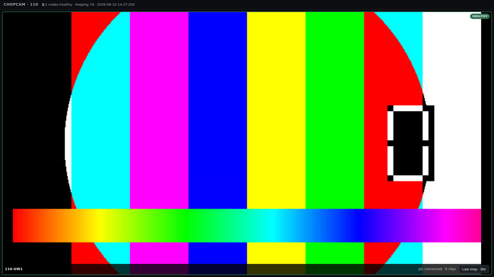
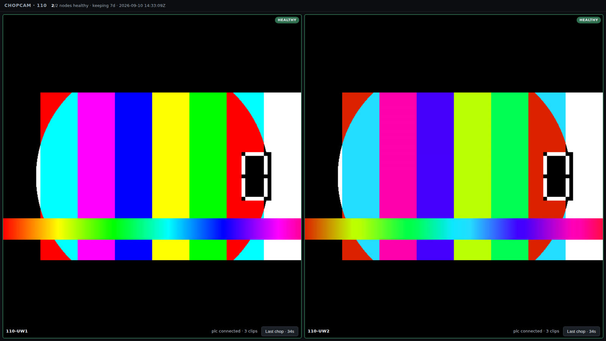
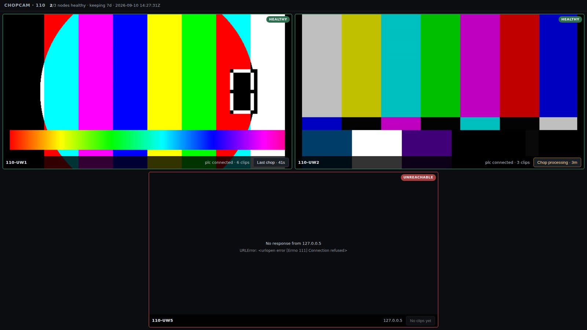
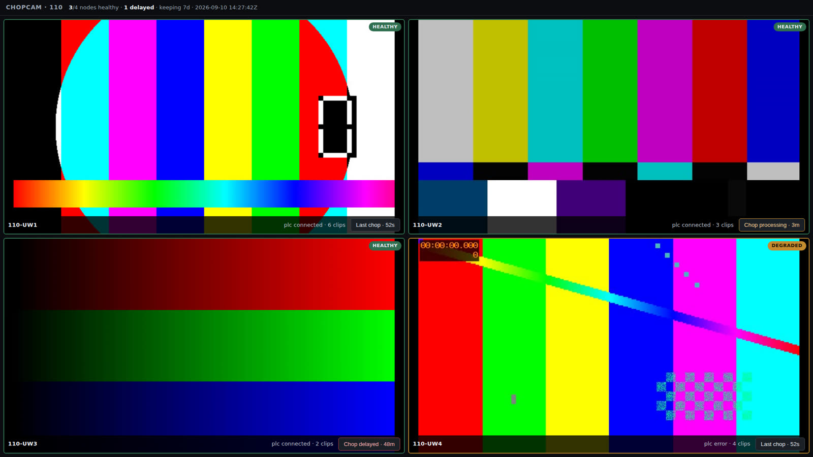
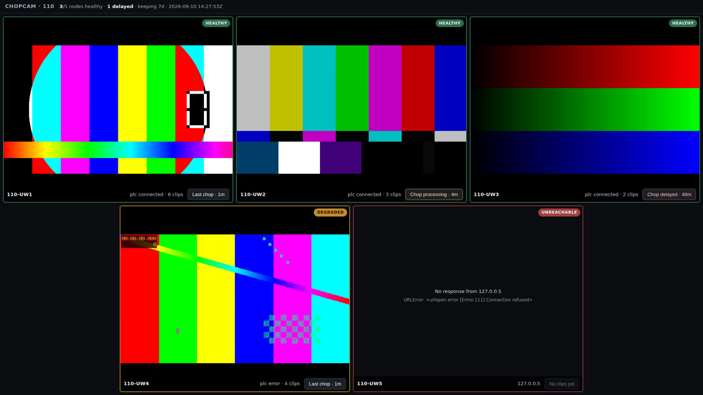
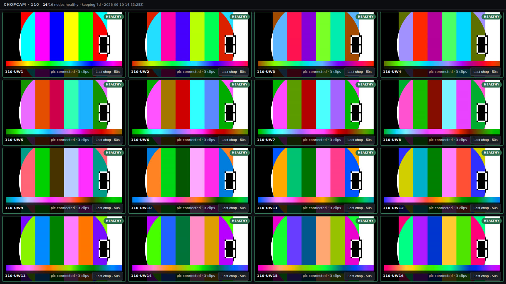
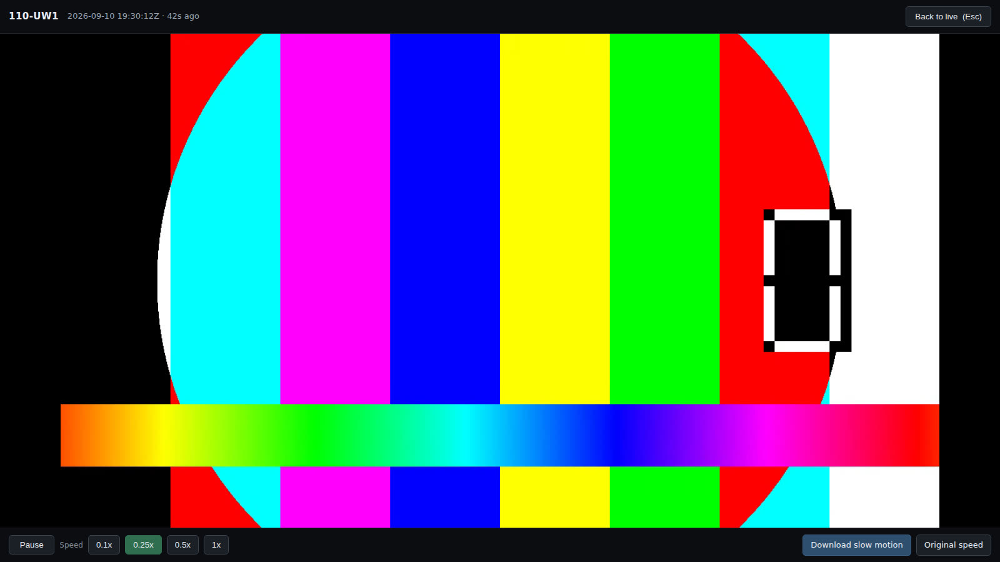
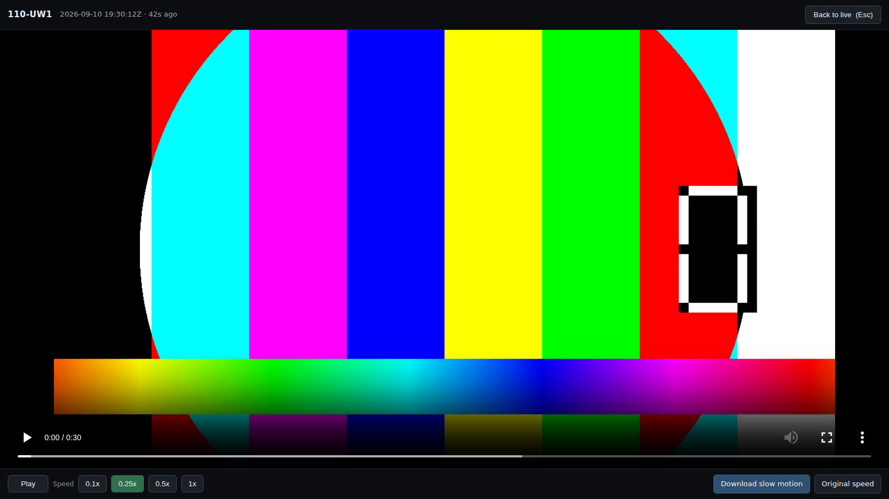

# Wall layouts

The aggregator arranges tiles from the number of cameras at that install, so
they fill the monitor rather than leaving a ragged row:

    columns = ceil(sqrt(n))      rows = ceil(n / columns)

| Cameras | Layout | | Cameras | Layout |
|---|---|---|---|---|
| 1 | 1 | | 6 | 3 × 2 |
| 2 | 2 | | 7 | 3 + 3 + 1 |
| 3 | 2 + 1 | | 8 | 3 + 3 + 2 |
| 4 | 2 × 2 | | 9 | 3 × 3 |
| 5 | 3 + 2 | | 16 | 4 × 4 |

A last row with fewer tiles than columns is **centred**, not left-aligned —
otherwise there is a hole in the corner that reads as a missing camera. Tiles
span two of a doubled column track, which makes that offset exact: centring two
tiles across three columns is half a tile, which whole tracks cannot express.

Narrow windows fall back to however many columns actually fit, so the wall stays
readable from a laptop instead of producing slivers, and it recomputes on
resize.

Adding or removing a camera is one entry in `NODES` and a restart. Nothing else
changes.

> The shots below use simulated nodes and test patterns in place of real
> cameras. The wall shots are 1920×1080; the player shots 1600×900. Every
> control and label is the real page — only the footage is synthetic.

---

## 1 camera

A single tile takes the whole screen. Healthy, with its most recent chop ready
to play.

## 2 cameras

Side by side, full height. A 16:9 feed letterboxes top and bottom here, because
the tile shape comes from dividing the screen, not from the feed.

## 3 cameras

Two over one, the bottom tile centred. This one shows three different states at
once: a delivered chop, one still transcoding on its node, and a node that is
not answering at all — covered, because an unreachable node otherwise keeps
showing its last frozen frame and reads as working.

## 4 cameras

An even 2 × 2.

## 5 cameras

Three over two, the bottom row centred. Every state the wall can show:

| Tile | Badge | Button | Meaning |
|---|---|---|---|
| UW1 | HEALTHY | `Last chop · 1m` | working normally |
| UW2 | HEALTHY | `Chop processing · 4m` | fired, still transcoding on the node |
| UW3 | HEALTHY | `Chop delayed · 48m` | **fired long ago and never arrived** |
| UW4 | DEGRADED | `Last chop · 1m` | node faulted, past clips still play |
| UW5 | UNREACHABLE | `No clips yet` | node offline |

UW3 is the one worth understanding. The node reports itself healthy — camera
streaming, PLC connected — yet its footage is not arriving. That is a wedged
transcode, a full disk or broken key auth, and nothing else in the system would
notice it. The header counts it too: `1 delayed`.

UW4 is the opposite: the node is sick, but clips it delivered earlier still
play fine.

## 16 cameras

A clean 4 × 4, needing no centring. All sixteen MJPEG streams run at once —
browsers cap connections at six *per host*, and each node is its own host, so
that limit never applies.

At this scale the constraint is decode, not connections: sixteen MJPEG streams
is a lot of JPEG for a Pi 5 to unpack. That is what `LIVE_FPS` on each node is
for — 5–8 fps per node keeps the wall comfortable. It is not something five
cameras will run into.

## Watching a chop

Every tile carries a button showing that camera's most recent clip and its age.
Click it and the clip fills the screen, playing at **0.25x**.

Top left is the node and when the chop was recorded, in UTC, with its age.
Along the bottom:

| Control | Does |
|---|---|
| **Pause** / **Play** | toggles; the spacebar does the same |
| **0.1x / 0.25x / 0.5x / 1x** | playback speed; 0.25x is where it opens |
| **Download slow motion** | a 4x slow copy that plays slowly in *any* player |
| **Original speed** | the true-speed file |
| **Back to live** (or Esc) | returns to the wall |

Pausing brings up the browser's own controls underneath, with the scrub bar and
the clip length — a 30 s chop, which takes two minutes to watch at quarter
speed:

There is an always-visible **Pause** button of our own because the browser's
controls fade out after a few seconds, and the monitor may have nothing to move
a pointer with.

### Why it opens at 0.25x

**On a 60 Hz monitor a 120 fps clip played at 1x can only show 60 of every 120
frames.** Half of what the camera captured is discarded at the display, no
matter how fast the machine is. At 0.25x the clip presents 30 frames a second,
comfortably under the refresh rate, so every captured frame is actually
displayed. Slow motion is not a convenience here — it is the only way to see
what the 120 fps capture bought.

It suits the hardware too. The Pi 5 has no hardware H.264 decoder, so clips are
software-decoded; at 0.25x the browser decodes about 30 frames a second rather
than 120. Real-time 1x is the marginal case, and the least useful one.

Opening the player tears down the live MJPEG streams and restores them on exit.
That is deliberate: each tile holds an open connection and keeps decoding, and
leaving several running while the Pi software-decodes a 120 fps clip is what
makes playback stutter.

### The download is a remux, not a re-encode

"Download slow motion" rescales the clip's timestamps — 120 fps restamped to
30 — so every frame survives and the file plays at quarter speed in anything,
including someone double-clicking it in Windows. Measured: 600 frames in, 600
out, 5.00 s becomes 19.98 s, in 0.08 s, same file size.

That matters because the Pi 5 has no H.264 *encoder* either. Re-encoding on
demand would be hopeless; a container rewrite is free. Clips are therefore
always stored at true speed, and slow motion is chosen on the way out.

### Reviewing carefully

A laptop on the same switch opens the same page at
`http://<aggregator>:8090/`, and is the better place to study a chop — it has
hardware H.264 decode, which the Pi 5 does not, so 1x playback and heavy
seeking behave properly.

For frame-by-frame work, download the clip and open it in **mpv**: `,` and `.`
step exactly one frame back and forward. VLC's `E` steps only *forward*, with no
reliable way back, which is maddening when you are hunting the exact frame of
contact.

## A note on tile shape

Tiles are sized by dividing the screen, so their aspect rarely matches the
camera's. The video uses `object-fit: contain`, so it is letterboxed rather than
stretched or cropped — deliberately, since cropping could hide the blade.

Two cameras is the worst case (tall tiles, wide feed) and six is the best fit on
a 16:9 monitor. Five lands close.
